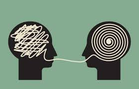

### Live Mentors
#### Prep Course for Software Development
##### &copy; All Rights Reserved by Live Mentors, 2025
---

## Learning How to Learn

Learning to code is challenging, but worth the effort. To quote Steve Jobs, 

"Everybody in this country should learn how to program a computer because it teaches you how to think."

Learning to code is not just about mastering a programming language. It is also about developing problem-solving skills, creativity, and logical thinking.

In this course, we shall explore the learning process and strategies to help you overcome obstacles and grasp the concepts on a fundamental level.

## Career Benefits

Most jobs today and in the future require software, data, logical thinking, and creative problem-solving. Learning to code opens opportunities in various industries like technology, finance, healthcare, and more.

With job displacement due to automation, coding skills help you stay relevant, transition to new careers, or advance in your current one.

This course covers the basics of transitioning into a software development career, exploring different roles and preparation strategies.

## How do LiveMentors Help?

Most students require a few key inputs to succeed in their quest of learning to code:

1. Structured Learning Path: A clear roadmap to follow, with a step-by-step guide.

1. Mentorship: Everyone needs guidance and support. A human mentor can understand and answer your questions, point you in the right direction, and help you stay motivated. Without this help, students may spend hours stuck on a problem that could be solved in minutes.

1. Accountability: Regular check-ins and deadlines help you stay on track and complete your goals. You get regular feedback on your progress and areas for improvement.

1. Community: Learning with others helps you stay motivated, share knowledge, and learn from others' experiences.

LiveMentors provides all these elements to help you succeed in your coding journey. We offer structured courses, experienced mentors, regular check-ins, and a supportive community to help you achieve your goals.

## How Long Does this Course Take?

This Prep Course is designed to be completed in a week (about 40 hours). However, the duration may vary based on your learning pace.

Each LiveMentors course has varying durations, depending on the complexity and depth of the subject. We recommend having a chat with your assigned Success Coach to understand the course duration and requirements, before starting.

#### Focused vs. Diffused Learning

Alternate between focused learning (concentrated effort on a task) and diffused learning (letting your mind wander). This balance helps embed concepts into memory by combining conscious and subconscious processing.

#### Memorization Techniques

Use tools like the Memory Palace to improve recall. Visualize familiar locations and place mental "objects" to organize information effectively.

#### Overcoming Procrastination

Identify triggers and apply strategies to stay consistent. Small, regular efforts build momentum and reduce learning barriers.

#### Time Management

Set a consistent study routine or use techniques like the Pomodoro Method (study for 25 minutes, break for 5).
Track study hours and deadlines with a planner or digital calendar.
Aim for 25–30 hours weekly, as recommended.

Remember, learning styles vary, experiment to find what works for you. Happy learning!

## Why learn to code? 

In the age of AI, coding has become essential for developing critical and logical thinking across industries. Coding not only enhances problem-solving by fostering creativity but also trains us to think like computers—a skill vital for collaborating with AI.

AI has the power to reshape the job market by automating tasks and boosting productivity. While this may raise concerns, AI actually shifts focus to creative, high-value activities, rather than replacing jobs entirely.

Much like calculators revolutionized complex problem-solving, AI enables professionals to handle meaningful tasks while automating repetitive work. Learning to code equips you with the technical and problem-solving skills needed to thrive in this evolving landscape.

[Next --> Digital Literacy](./02%20Digital%20Literacy.md)
